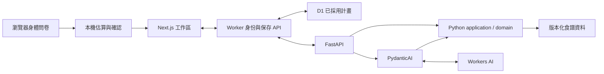

# Meal Prep Agent — 技術選型與架構

更新：2026-09-28。採用 Next.js＋TypeScript、FastAPI＋PydanticAI、AG-UI，單一 repo、後端 Modular Monolith。這是已確認的開發方向；尚未安裝依賴、建立應用或部署，K1–K4 全部待驗證。

[產品規格](product-spec.md) 定義 A1–A14；[營養政策](nutrition-policy.md) 定義數值、公式及 N1–N8。本文件是技術選型與模組責任的主要依據。

## 1. 決策與範圍

參考既有探索型 Agent 的技術與專案結構，依本產品約束重新選擇：

| 議題 | 選項與取捨 | 本版決定 |
|---|---|---|
| 語言與框架 | 全 TypeScript 可共用語言，但原 ADK／Workers 方案需驗證自訂橋接；Python API 可集中模型與業務規則，但增加跨語言契約及部署服務 | Next.js＋FastAPI／PydanticAI；取代先前 ADK TypeScript 草案，並非已執行程式遷移 |
| 模組 | 全域技術分層容易跨功能耦合；Modular Monolith 保留業務邊界且可單體部署；微服務增加協調成本 | 單一 repo，Python 依業務模組組織 |
| 執行生命週期 | Request 範圍簡單；Temporal 適合跨請求、長時間、可恢復工作，但需要持久化及運維 | 先做 request 範圍的 Agent run；Temporal 留待需求成立後另議 |
| 計畫保存 | 分頁記憶體無重開恢復；瀏覽器保存限本機；D1＋匿名 Cookie 支援雲端保存但需伺服器歸屬檢查；登入帳號可跨裝置但增加身份管理 | 已選 D1＋匿名 Cookie，取代 IndexedDB；一階復原、30 天未修改到期，不加入登入或跨裝置找回 |
| 計算責任 | 全放後端便於集中規則，但上傳身體問卷會改變已確認的資料邊界 | 餐單計算與驗證在 Python；身體問卷的起始估算維持瀏覽器內進行 |

維持三天餐單、雙目標入口、自煮＋固定外食與免費模型限制。參考專案的 Temporal、資料庫、登入、主機資源及付費預算不隨技術選型一起引入。

## 2. 技術與部署

| 層 | 選型與責任 |
|---|---|
| Web | Next.js App Router＋TypeScript；route 薄層、功能置於 features；本機計畫由 Client Components 存取 |
| API | FastAPI＋Pydantic；HTTP 與 Agent tools 呼叫同一組 Python application use cases |
| Agent | PydanticAI 管理模型／工具迴圈；官方 AGUIAdapter 輸出 AG-UI，Web 使用 HttpAgent |
| 契約 | Pydantic／OpenAPI 為 API schema 來源，openapi-typescript／openapi-fetch 產生 TS client；生成型別不取代執行時驗證 |
| 計算 | Python Decimal 負責餐單；瀏覽器 decimal.js 僅負責身體估算，不複製配餐引擎 |
| 保存 | Worker 經 D1 binding 存取，SQL migrations 版本化；匿名 Cookie 識別擁有者，單列 CAS 更新 current／previous；Web 只留記憶體鏡像 |
| 工具 | Web 使用 pnpm、Python 使用 uv，各自鎖定依賴；pytest、Vitest、Playwright 依責任驗證 |

Web 優先評估 Cloudflare Workers 的 [vinext 路徑](https://developers.cloudflare.com/workers/framework-guides/web-apps/nextjs/)，不符需求再評估 [OpenNext](https://developers.cloudflare.com/workers/framework-guides/web-apps/opennext/)。實際依賴版本及指令在整合驗證後寫入 lockfile 和 README，不預先宣稱任一套件可直接部署。

FastAPI／PydanticAI 在獨立 Python 主機執行，不放進 workerd。Workers 提供 Web、匿名 session／餐單保存 API 與固定上游的 Python／AG-UI proxy：限制路徑、方法與 body，不能成為任意 URL proxy；使用者資料回應不得共享快取。Python 主機的容量、費用及入口隔離尚待定案，不能把允許 Cloudflare 解讀成已有免費 Python 主機。先完成本機整合，再決定部署；不複製其他產品的環境檔或憑證。

免費模型首個候選為 Workers AI `@cf/zai-org/glm-4.7-flash`，依據 [模型卡](https://developers.cloudflare.com/workers-ai/models/glm-4.7-flash/) 與 [免費模型資格公告](https://developers.cloudflare.com/changelog/post/2026-07-28-models-require-workers-paid/)。Python 透過 [OpenAI-compatible endpoint](https://developers.cloudflare.com/workers-ai/configuration/open-ai-compatibility/) 接入；資格、工具往返及 PydanticAI 相容性仍須實測。憑證只留後端；不因介面相容就宣稱整合完成。

## 3. 資料流與權威狀態



- D1 是已採用計畫的保存來源；Python 是餐單規則及衍生值的計算來源；AG-UI 只運送暫存互動，不等於採用。
- 已確認目標送 API 驗證 → Agent 選受控候選 → Python 產生完整提案與差異 → 使用者預覽 → Worker 讀取 base 並交 Python 重新驗證 → D1 CAS 採用。
- 卡片調份量直接呼叫同一組 use case，不必經過模型。新請求從最新已採用快照重建上下文，不把前次未採用提案當成生效計畫。
- 關頁或取消以 best effort 中止 run；沒有背景接續或跨請求恢復保證，重試會建立新 run。

## 4. 專案結構與依賴

以下是預計結構，尚未建立目錄或程式：

```text
apps/web/src/
  app/                         # routes、layouts、薄組合層
  features/
    goals/                     # 本機估算及目標確認
    planner/                   # 餐單、提案、差異與採用
    shopping/
    prep/
    chat/
  shared/
    ui/
    api/                       # 生成 client 與邊界驗證
    storage/                   # 雲端 PlanRepository client，不持久化餐單
apps/web/server/
  persistence/                 # D1 binding、匿名身份、CAS 與保存 routes
  proxy/                       # 固定上游 Python／AG-UI
backend/
  pyproject.toml
  src/meal_prep/
    bootstrap/                 # FastAPI、依賴組裝
    modules/
      nutrition/
      recipes/
      planning/
        domain/
        application/
        api/
        agents/
      shopping/
      prep/
    platform/                  # 模型傳輸、技術設定、觀測
  tests/
contracts/                     # 生成 OpenAPI／公開保存 schema
data/                        # 版本化合成資料及政策資料
tests/e2e/
deploy/
  migrations/                  # D1 SQL migrations
```

目錄中的 `data/`、`tests/e2e/`、`deploy/` 均位於 repo 根目錄。僅在有實際責任時建立子層，不為每個模組複製空框架。

Python 的 domain 不依賴 FastAPI、PydanticAI 或外部 I/O；API 與 tools 經 application 呼叫規則。planning 協調 nutrition／recipes／shopping／prep 的公開介面，不匯入他模組內部實作。platform 僅放技術基礎，不收容業務規則。Web shared 不反向依賴 features；跨功能透過公開介面組合。

Python 採 src layout，開發以 editable install、CI 以 wheel 安裝並從 repo 外測試 import；不靠臨時 PYTHONPATH 掩蓋封裝問題。此版只建立必要的 Worker 匿名身份與保存模組，不預建登入帳號、Temporal workflow 或 ORM 模組。

## 5. 契約、計算與隱私

### 5.1 公開契約

Pydantic 定義 API DTO（包含 Worker 保存端點的 request／response），生成 OpenAPI 與 TS client；Worker 的實際 routes 另做契約一致性測試，不能以 Python schema 存在就當成已實作。SavedPlan 的公開 schema 同源版本化，讀取仍要做 runtime validation。CI 比對生成結果，避免手改 TS 後與 Python 漂移。

Proposal 包含 planId、baseRevision、sessionGeneration、runId、scope、完整候選快照、diff 與 violations。PlanRevision 保留食譜及營養來源快照、catalogVersion、nutritionPolicyVersion、calculationVersion、庫存與購物／料理勾選。版本不相容時拒絕新的修改，不悄悄重解舊餐單。

ID 採 UUID；revision 為安全整數、只增不減；時間戳為 UTC，餐單日期用明確日曆日期。外部輸入、AG-UI state、模型參數及雲端資料皆不可信，按用途驗證。來源版本須能由後端受控資料核對，不能只相信前端宣稱。

### 5.2 數值及身體估算

Python Decimal 與窄範圍的 Web estimator 統一 32 位有效數字、ROUND_HALF_UP；用原始十進位值進入計算，不先用 binary float 算術。缺值維持 null，非有限數或非法數值拒絕；API 的 Decimal 序列化明確固定為契約規定的 JSON number／null，不能任由框架預設輸出字串而失配。取整僅依營養政策指定的位置進行。

DRI 係數及 golden fixtures 以版本化政策資料維護，Web 由該資料生成估算資源。Python 驗證已確認目標的數值範圍及能量一致性，負責配餐、份量與清單；不另外建立需上傳問卷的第二套身體估算服務。N1–N8 依此拆分為 Web estimator 與 API 目標驗證案例。

身體問卷的年齡、身高、體重等只存在當次瀏覽器記憶體，不進 SSR、API、模型、log 或 D1。後端只能驗證已確認目標，不能宣稱已核驗未取得的原始身體資料。自由聊天仍會送模型，介面須分別說明。

### 5.3 配餐與衍生資料

受控食譜候選 → 份量搜尋 → 每日營養與硬限制驗證 → 庫存／購物／備餐 → 完整差異。模型只能選擇資料及解釋，不計算或補造未知營養。

先採有限搜尋，起始上限為 beam 16、每餐 4 候選、3 輪，待量測調整；搜尋未找到不等於證明無解或全域最優。鎖定與 scope 外內容必須精確保留；固定外食不加入自煮購物清單，未知營養維持 null 並標示完整性。料理合併須保留食材／步驟依賴，同一設備先序列安排；被替換內容的勾選失效，未受影響內容保留。

## 6. API 與 Agent 執行

| 入口 | 責任 |
|---|---|
| `GET /health` | 技術健康狀態，不包含使用者內容或模型呼叫 |
| `POST /api/v1/plans/evaluate` | 不呼叫模型的餐單重算；用於調份量及恢復後驗證 |
| `POST /api/v1/proposals/validate` | 重算、檢查 scope／鎖定及來源，回 canonical proposal；只回 canonical candidate，不直接寫 D1 |
| `POST /agent` | request-scoped PydanticAI run，透過官方 AGUIAdapter 串流 |

初始 tools 為 find_recipes、build_proposal，呼叫相同 application use cases；不開放任意網頁、檔案或任意程式執行。prompt、model 與 tools allowlist 由伺服器決定；請求僅攜帶有界的必要上下文，不保存跨使用者全域 run state。

依 [PydanticAI AG-UI 文件](https://pydantic.dev/docs/ai/integrations/ui/ag-ui/)，取消可能仍輸出 `RUN_FINISHED`。因此單憑結束事件不能認定成功：只有 application 明確輸出 `proposal_ready`、候選通過完整驗證且 run／revision 仍有效，UI 才允許採用。取消或失效立即撤銷本地 run token，晚到事件丟棄。斷線時清理串流與 run，不承諾已送出的 provider 工作一定停止。

HTTP 重試可能再次執行模型，不承諾模型呼叫 exactly once。採用是獨立的保存操作，以伺服器 revision 與 operationId 防止重複套用；網路斷線不等於寫入失敗，重試前須讀回確認。

## 7. D1、匿名身份與保存

### 7.1 身份與信任邊界

Worker 以密碼學安全亂數建立至少 256-bit opaque token，透過 `__Host-meal_session` Cookie 傳回：HttpOnly、Secure、SameSite=Lax、Path=/、不設 Domain。D1 只保存 token hash，不在 URL、Web storage、log、trace、Python 或模型 payload 放 token。它是持有者憑證，不是可公開的 planId。

首次使用以同 origin 的 `POST /api/session` 明確建立空 session；普通讀寫遇缺少／未知／到期 Cookie 不自動重建。使用者可選擇開始新計畫；沒有帳號、找回連結或跨裝置登入。所有讀寫均由 Worker 依 Cookie 查擁有者，不採信 request body 的 owner；異主 planId 與不存在回相同 not-found。寫入驗證 Origin、JSON content type 及 CSRF token／同源 header；不能只靠 SameSite。餐單與 session 回應 no-store，GET 不做隱含內容修改。

Python 僅接受可信 Worker 的服務請求，不能由公開入口繞過；服務驗證方式於部署定案，secret 不進瀏覽器。Worker 讀取 D1 base，向 Python 傳送已採用快照與操作意圖；Python 重新計算 canonical candidate。Worker 不接受瀏覽器自稱已驗證的 proposal 直接落庫，也不複製營養規則。Agent 上下文同樣以 Worker 取得的 base 為準。

### 7.2 單列狀態與原子修改

D1 的 `plan_sessions` 每個匿名身份一列：tokenHash（唯一）、sessionGeneration、planId（可空）、revision、schemaVersion、currentJson、previousJson、updatedAt、expiresAt、lastOperationId、lastOperationHash。空 session 同樣有 revision／期限；current 與 previous 在同一列，避免跨列寫一半。期限／tokenHash 建索引；JSON snapshot 必須通過公開契約驗證。

Python 計算在寫入前完成。Worker 用單一 prepared `UPDATE ... WHERE tokenHash = ? AND sessionGeneration = ? AND revision = ? AND expiresAt > ?` 寫 current、previous、遞增 revision 與操作識別；時間由伺服器決定，另核對 planId／契約版本。檢查實際 changes，只有一列更新才回成功；零列表示衝突、到期或身份失效，不能回假成功。首次採用更新既有空 session，不以 upsert 建回被清除的身份。

復原以 previous 建新 revision、清空 previous；鎖定與勾選也走條件寫入。相同 operationId＋payload hash 的重試，只有確認已提交該操作才回已完成；同 id 不同 payload 拒絕。若期間已有後續修改則要求重新讀取，不重新套用舊操作。多頁通知只改善畫面，真正防覆寫由 D1 CAS 決定。第一版不開 read replication；若後續啟用，須另驗證 session bookmark 與 read-after-write。

依據 [D1 prepared statements](https://developers.cloudflare.com/d1/worker-api/prepared-statements/) 與 [D1 API](https://developers.cloudflare.com/d1/worker-api/d1-database/)；不照搬 IndexedDB transaction 或假設任意 interactive SQL transaction 可用。實際 CAS／競爭行為須以本地 D1 及部署 D1 證明。

### 7.3 API、期限、清除及故障

Worker 公開入口：`POST /api/session` 建立匿名身份；`GET /api/plan` 讀取；`POST /api/plan/actions` 以明確 action（adopt／portion／locks／checks／undo）、baseRevision、operationId 執行；`DELETE /api/session` 清除。現有 Python evaluate／validate 與 `/agent` 經固定 proxy 使用，不開放任意 upstream。刪除會使身份失效，任何舊 run／請求不得重建 session。

保存目前與前一版，身體問卷、聊天、未採用提案不落 D1。維持 30 天未修改到期，只有成功內容修改續期；Cookie 期限跟隨服務端 expiresAt，查看不續期。所有讀寫先驗期限；排程每日清理過期列，即使排程延遲也無法讀取或修改過期內容。Cookie 遺失不代表雲端立即刪除，資料依期限清理；刪除不承諾平台備份立即清除。

清除先在本頁撤銷 run，伺服器刪除該身份列後才顯示雲端已清除並移除 Cookie；失敗提供重試，不冒稱已刪。與更新競爭時，以資料庫完成順序為準，刪除後舊 token 沒有可更新列。新 session 使用新 token／generation，不復用舊身份。請求結果不明時先讀回，避免顯示不實成功或失敗。

Web 只保留當次頁面記憶體；D1／保存 API 不可用時，已載入餐單可唯讀檢視，採用、復原及勾選都不得冒稱已保存，不另加入本機持久化 fallback。重新開頁需雲端可用才能恢復。模型額度耗盡不影響 D1 讀寫或純計算；Python 不可用時，讀取及不需配餐計算的勾選／復原可由 Worker 處理。未知 schema 不靜默改寫或刪除。

D1 免費方案超過每日讀寫限額會拒絕查詢，額度政策依 [官方定價](https://developers.cloudflare.com/d1/platform/pricing/)；不自動升級付費。限制匿名 session 建立頻率與儲存大小，索引避免全表掃描；D1 故障與模型額度故障分開呈現。

## 8. 限額與運行邊界

預設 fixture、明確切換 live，不以預錄結果冒充模型成功。免費資格、每日 Neurons、耗盡行為以產品規格第 10.1 節為準，沒有付費 fallback。

初始限制：每分頁一個 active run、request 128 KiB、單訊息 2,000 字、上下文最多 8 則／8,000 字、每輪最多 4 次模型呼叫／8 次工具／60 秒、單次輸出最多 2,048 tokens。這些是待 K4 調整的應用預算，不能當成帳戶費用硬上限。

公開入口限流，Python 同時限制 body、執行次數與時間；隔離直接後端入口以免繞過 proxy。多 process semaphore 不是全域額度，須核對帳戶共用量。記錄技術狀態、延遲及用量，不記問卷、訊息或完整提案；tracing 也須檢查內容擷取設定。

Web／API／契約／政策版本不相容時停止新操作、提示重新載入並保留原資料。第一版不加入 Service Worker 或離線配餐引擎。

## 9. 整合驗證與完成門檻

以下皆為待驗證條件，不是已完成結果；取代舊 ADK gates。[TDD 計畫](implementation-plan.md) T00–T03 先完成最小技術可行性驗證，完整條件隨功能逐步驗收；不能要求尚未實作的功能先完成產品驗收，也不能把 probe 成功記成完整 gate 通過。

| Gate | 通過條件 |
|---|---|
| K1 契約與封裝 | Python wheel 可從 repo 外 import；模組依賴符合第 4 節；OpenAPI 生成 TS client，Decimal／null／日期／版本測試一致；Web 估算與 API 目標驗證通過對應 N1–N8 |
| K2 Agent 往返 | PydanticAI＋Workers AI 完成 tool call → 確定性計算 → tool result → typed proposal；官方 AG-UI adapter 可串流，取消／錯誤／晚到事件不產生可採用的假成功 |
| K3 執行與保存 | Next.js 在實際 workerd／Workers 環境完成 hydration、固定上游 SSE proxy、斷線及資源量測；另驗證 Python 主機容量和入口隔離；瀏覽器通過 A13／A14、匿名身份歸屬與 D1 故障恢復 |
| K4 品質與免費用量 | A1、A3、A5、A10 各至少 3 次 live，關鍵約束全部通過；記錄模型版本、繁中品質、token／Neuron 及延遲；模擬額度耗盡，確認無付費 fallback；免費不足則分日驗證 |

Worker CPU 限制只用於 Web／proxy；Python 的時間及記憶體另量測。Node build、fixture 或文件檢查都不能替代實際 runtime／live 結果。

## 10. 實作與驗證順序

具體 RED／GREEN、相依與證據依 [TDD 實作計畫](implementation-plan.md) T00–T12 執行，本節保留概覽。

沿用產品規格第 11 節相依順序：最小 Web／API／AG-UI 契約 → Python 計算及資料、Web 估算 → 提案與 D1 保存 → live 與部署。先走手動目標、三天提案、採用、局部換菜、清單與重開恢復的切片，再補齊完整 A1–A14，不縮減已確認 MVP。

pytest 驗證 Python 業務規則；Vitest 驗證 Web estimator／state／storage；Playwright 驗證兩入口、串流、跨分頁、匿名身份及 D1 保存失敗。合成案例可重跑與真模型驗收分開記錄。尚無實際測試或命令；建立骨架後再補 README／AGENTS。

若未來需要長時間接續任務或跨裝置資料，再分別評估 Temporal 與帳號／PostgreSQL，重新定義資料權威及恢復契約；本次不預建這些能力。
