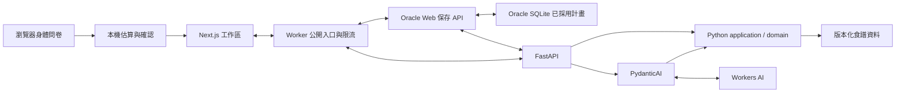

# Meal Prep Agent — 技術選型與架構

更新：2026-09-30。採用 Next.js＋TypeScript、FastAPI＋PydanticAI、AG-UI，單一 repo、後端 Modular Monolith。雙入口、餐單與正式 Agent 已實作；Oracle Web／API、SQLite 保存及 Cloudflare 入口已部署。D1→SQLite 資料切換與 K3 Free CPU 重驗已完成；K1／K2／K4 與遠端 CI 證據見 [驗收紀錄](verification.md)。

[產品規格](product-spec.md) 定義 A1–A14；[營養政策](nutrition-policy.md) 定義數值、公式及 N1–N8。本文件是技術選型與模組責任的主要依據。

## 1. 決策與範圍

參考既有探索型 Agent 的技術與專案結構，依本產品約束重新選擇：

| 議題 | 選項與取捨 | 本版決定 |
|---|---|---|
| 語言與框架 | 全 TypeScript 可共用語言，但原 ADK／Workers 方案需驗證自訂橋接；Python API 可集中模型與業務規則，但增加跨語言契約及部署服務 | Next.js＋FastAPI／PydanticAI；取代先前 ADK TypeScript 草案，並非已執行程式遷移 |
| 模組 | 全域技術分層容易跨功能耦合；Modular Monolith 保留業務邊界且可單體部署；微服務增加協調成本 | 單一 repo，Python 依業務模組組織 |
| 執行生命週期 | Request 範圍簡單；Temporal 適合跨請求、長時間、可恢復工作，但需要持久化及運維 | 先做 request 範圍的 Agent run；Temporal 留待需求成立後另議 |
| 計畫保存 | 分頁記憶體無重開恢復；瀏覽器保存限本機；Oracle SQLite＋匿名 Cookie 免登入且可重開恢復，主機故障復原需自行備份；PostgreSQL 易於多服務擴充但增加維運；受管資料庫省維運但改變自有資料落點 | Oracle Web 專用 SQLite volume＋匿名 Cookie，取代 D1 與 IndexedDB；一階復原、30 天未修改到期，本版不排程備份，不加入登入或跨裝置找回 |
| 計算責任 | 全放後端便於集中規則，但上傳身體問卷會改變已確認的資料邊界 | 餐單計算與驗證在 Python；身體問卷的起始估算維持瀏覽器內進行 |

維持三天餐單、雙目標入口、自煮＋固定外食與免費模型限制。參考專案的 Temporal、資料庫、登入、主機資源及付費預算不隨技術選型一起引入。

## 2. 技術與部署

| 層 | 選型與責任 |
|---|---|
| Web | Next.js App Router＋TypeScript；route 薄層、功能置於 features；瀏覽器記憶體鏡像由 Client Components 存取 |
| API | FastAPI＋Pydantic；HTTP 與 Agent tools 呼叫同一組 Python application use cases |
| Agent | PydanticAI 管理模型／工具迴圈；官方 AGUIAdapter 輸出 AG-UI，Web 使用 HttpAgent |
| 契約 | Pydantic／OpenAPI 為 API schema 來源，openapi-typescript／openapi-fetch 產生 TS client；生成型別不取代執行時驗證 |
| 計算 | Python Decimal 負責餐單；瀏覽器 decimal.js 僅負責身體估算，不複製配餐引擎 |
| 保存 | Oracle Next.js Node route 處理匿名身份、CSRF、canonical 提案採用與 SQLite 單列 CAS；專用持久 volume 保存 current／previous；瀏覽器只留記憶體鏡像 |
| 工具 | Web 使用 pnpm、Python 使用 uv，各自鎖定依賴；pytest、Vitest、Playwright 依責任驗證 |

Web 採原生 Next.js standalone，與 FastAPI／PydanticAI 分別部署到既有 Oracle VM 的專用容器。2026-09-29 經使用者確認：vinext SSR 實測超過 Workers Free CPU 預算，預先渲染亦未通過；因此撤除 vinext runtime，保留 Next.js 與原有產品契約。相較將 SSR 留在 Worker，這增加 Web 容器的維運責任，但可使用原生 Next.js 且不啟用付費 Workers。

Cloudflare Worker 提供公開入口、限流與固定上游 proxy，不執行 Next.js SSR 或保存 SQL。MEAL_WEB VPC binding 代理 GET／HEAD 頁面及明列的保存 API；保存路徑只轉送該匿名 session Cookie、Origin／CSRF 等必要標頭，回傳 `Set-Cookie`，不轉送 Authorization。MEAL_API VPC binding 代理固定 Python 公開路徑，不接收匿名 Cookie。未知 API 一律拒絕，使用者資料回應不得共享快取。

Oracle 的 Web、API 與具名 Tunnel 使用專案獨立容器／網路，不發布 host port，也不設公開 Tunnel hostname。Web 容器唯一掛載可寫 SQLite 目錄，不持有模型憑證；API 容器不持有匿名 Cookie 或資料庫 volume。Worker 經兩個固定 VPC service 連線；本機測試才使用明確 loopback origin。容量、串流、Worker CPU、SQLite 持久化及私有入口由 T11 在切換後重驗。部署及回復命令見 [deploy/README.md](../deploy/README.md)。

免費模型首個候選為 Workers AI `@cf/zai-org/glm-4.7-flash`，依據 [模型卡](https://developers.cloudflare.com/workers-ai/models/glm-4.7-flash/) 與 [免費模型資格公告](https://developers.cloudflare.com/changelog/post/2026-07-28-models-require-workers-paid/)。Python 透過 [OpenAI-compatible endpoint](https://developers.cloudflare.com/workers-ai/configuration/open-ai-compatibility/) 接入；資格、工具往返及 PydanticAI 相容性已有驗收，證據見 verification.md；版本或供應商條件變更時重驗。憑證只留後端；不因介面相容就宣稱整合完成。

## 3. 資料流與權威狀態



- Oracle SQLite 是已採用計畫的保存來源；Python 是餐單規則及衍生值的計算來源；AG-UI 只運送暫存互動，不等於採用。
- 已確認目標送 API 驗證 → Agent 選受控候選 → Python 產生完整提案與差異 → 使用者預覽 → Oracle Web 讀取 base 並交 Python 重新驗證 → SQLite CAS 採用。
- 卡片調份量直接呼叫同一組 use case，不必經過模型。新請求從最新已採用快照重建上下文，不把前次未採用提案當成生效計畫。
- 關頁或取消以 best effort 中止 run；沒有背景接續或跨請求恢復保證，重試會建立新 run。

## 4. 專案結構與依賴

以下列出主要責任；實際路徑與命令以 repo 為準：

```text
apps/web/src/
  app/                         # routes、layouts、薄組合層
  features/
    goals/                     # 本機估算及目標確認
    planner/                   # 餐單、提案、差異與採用
    shopping/
    prep/
    chat/
  shared/
    ui/
    api/                       # 生成 client 與邊界驗證
    storage/                   # 雲端 PlanRepository client，不持久化餐單
apps/web/src/server/
  persistence/                 # Oracle SQLite、匿名身份、CAS 與保存邏輯
  persistence-proxy.ts         # Worker 固定轉送保存 API
  python-proxy.ts              # Worker 固定 Python 路徑
backend/
  pyproject.toml
  src/meal_prep/
    bootstrap/                 # FastAPI、依賴組裝
    modules/
      nutrition/
      recipes/
      planning/
        domain/
        application/
        api/
        agents/
      shopping/
      prep/
    platform/                  # 模型傳輸、技術設定、觀測
  tests/
contracts/                     # 生成 OpenAPI／公開保存 schema
data/                        # 版本化合成資料及政策資料
tests/e2e/
deploy/
  migrations/                  # 現行 SQLite schema，供明確初始化與測試使用
  data/                        # Oracle 主機專用 SQLite volume，不進 Git
```

目錄中的 `data/`、`tests/e2e/`、`deploy/` 均位於 repo 根目錄。僅在有實際責任時建立子層，不為每個模組複製空框架。

Python 的 domain 不依賴 FastAPI、PydanticAI 或外部 I/O；API 與 tools 經 application 呼叫規則。planning 協調 nutrition／recipes／shopping／prep 的公開介面，不匯入他模組內部實作。platform 僅放技術基礎，不收容業務規則。Web shared 不反向依賴 features；跨功能透過公開介面組合。

Python 採 src layout，開發以 editable install、CI 以 wheel 安裝並從 repo 外測試 import；不靠臨時 PYTHONPATH 掩蓋封裝問題。此版只建立必要的 Web 匿名身份與保存模組，不預建登入帳號、Temporal workflow 或 ORM 模組。

## 5. 契約、計算與隱私

### 5.1 公開契約

Pydantic 定義 API DTO（包含 Web 保存端點的 request／response），生成 OpenAPI 與 TS client；Node 的實際 routes 另做契約一致性測試，不能以 Python schema 存在就當成已實作。SavedPlan 的公開 schema 同源版本化，讀取仍要做 runtime validation。CI 比對生成結果，避免手改 TS 後與 Python 漂移。

Proposal 包含 planId、baseRevision、sessionGeneration、runId、scope、完整候選快照、diff 與 violations。PlanRevision 保留食譜及營養來源快照、catalogVersion、nutritionPolicyVersion、calculationVersion、庫存與購物／料理勾選。版本不相容時拒絕新的修改，不悄悄重解舊餐單。

ID 採 UUID；revision 為安全整數、只增不減；時間戳為 UTC，餐單日期用明確日曆日期。外部輸入、AG-UI state、模型參數及雲端資料皆不可信，按用途驗證。來源版本須能由後端受控資料核對，不能只相信前端宣稱。

### 5.2 數值及身體估算

Python Decimal 與窄範圍的 Web estimator 統一 32 位有效數字、ROUND_HALF_UP；用原始十進位值進入計算，不先用 binary float 算術。缺值維持 null，非有限數或非法數值拒絕；API 的 Decimal 序列化明確固定為契約規定的 JSON number／null，不能任由框架預設輸出字串而失配。取整僅依營養政策指定的位置進行。

DRI 係數及 golden fixtures 以版本化政策資料維護，Web 由該資料生成估算資源。Python 驗證已確認目標的數值範圍及能量一致性，負責配餐、份量與清單；不另外建立需上傳問卷的第二套身體估算服務。N1–N8 依此拆分為 Web estimator 與 API 目標驗證案例。

身體問卷的年齡、身高、體重等只存在當次瀏覽器記憶體，不進 SSR、API、模型、log 或 SQLite。後端只能驗證已確認目標，不能宣稱已核驗未取得的原始身體資料。自由聊天仍會送模型，介面須分別說明。

### 5.3 配餐與衍生資料

Agent tool、HTTP preview 與 fixture 候選選擇共用 async calculation runner，以 asyncio.to_thread 執行同步搜尋；每 process 同時最多一個計算、零排隊，額滿回 calculation_unavailable。搜尋在擴展與 canonical 驗證前檢查取消訊號，取消時等待計算 thread 退出再釋放容量。disconnect monitor 另有明確停止旗標，避免取消被 probe 吞掉後持續占用容量。這是 event-loop 隔離，並非增加 CPU 平行算力；evaluate／validate 的普通 FastAPI def route 仍使用 framework threadpool。

受控食譜候選 → 份量搜尋 → 每日營養與硬限制驗證 → 庫存／購物／備餐 → 完整差異。模型只能選擇資料及解釋，不計算或補造未知營養。

先採有限搜尋，起始上限為 beam 16、每餐 4 候選、3 輪，維持本版驗收值；受控食譜規模改變或搜尋耗時增加時重評；搜尋未找到不等於證明無解或全域最優。鎖定與 scope 外內容必須精確保留；固定外食不加入自煮購物清單，未知營養維持 null 並標示完整性。料理合併須保留食材／步驟依賴，同一設備先序列安排；被替換內容的勾選失效，未受影響內容保留。

## 6. API 與 Agent 執行

| 入口 | 責任 |
|---|---|
| `GET /health` | 技術健康狀態，不包含使用者內容或模型呼叫 |
| `POST /api/v1/goals/validate` | 驗證明確輸入的營養目標草稿並回傳範圍；不接收身體問卷、不保存、不自動確認 |
| `POST /api/v1/plans/evaluate` | 接收 candidate 與可選完整 base Evaluation；不呼叫模型地重算，保留未受影響勾選，用於調份量及恢復後驗證 |
| `POST /api/v1/proposals/build` | 不呼叫模型的有限搜尋，卡片與 Agent 共用 build_proposal；回候選或具體未找到原因，不保存 |
| `POST /api/v1/proposals/validate` | 重算、檢查 scope／鎖定及來源，回 canonical proposal；只回 canonical candidate，不直接寫 SQLite |
| `POST /agent` | request-scoped PydanticAI run，透過官方 AGUIAdapter 串流 |

初始 tools 為 find_recipes、build_proposal，呼叫相同 application use cases；不開放任意網頁、檔案或任意程式執行。prompt、model 與 tools allowlist 由伺服器決定；請求僅攜帶有界的必要上下文，不保存跨使用者全域 run state。

模型判讀自然語言並選擇受控工具；對話中的餐單結論只根據通過驗證的 `proposal_ready` 或 `proposal_unavailable` 原因顯示。模型自由文字不直接當作營養數值、已採用狀態或已保存證明。已確認目標、限制與固定餐點只能由使用者表單確認，tool 不接受模型在本輪改寫；預覽卡片呈現 canonical 來源與數字。

依 [PydanticAI AG-UI 文件](https://pydantic.dev/docs/ai/integrations/ui/ag-ui/)，取消可能仍輸出 `RUN_FINISHED`。因此單憑結束事件不能認定成功：只有 application 明確輸出 `proposal_ready`、候選通過完整驗證且 run／revision 仍有效，UI 才允許採用。取消或失效立即撤銷本地 run token，晚到事件丟棄。斷線時清理串流與 run，不承諾已送出的 provider 工作一定停止。

HTTP 重試可能再次執行模型，不承諾模型呼叫 exactly once。採用是獨立的保存操作，以伺服器 revision 與 operationId 防止重複套用；網路斷線不等於寫入失敗，重試前須讀回確認。

## 7. Oracle SQLite、匿名身份與保存

### 7.1 身份與信任邊界

Oracle Web 以密碼學安全亂數建立至少 256-bit opaque token，透過 `__Host-meal_session` Cookie 傳回：HttpOnly、Secure、SameSite=Lax、Path=/、不設 Domain。SQLite 只保存 token hash，不在 URL、Web storage、log、trace、Python 或模型 payload 放 token。它是持有者憑證，不是可公開的 planId。

首次使用以同 origin 的 `POST /api/session` 明確建立空 session；普通讀寫遇缺少／未知／到期 Cookie 不自動重建。使用者可選擇開始新計畫；沒有帳號、找回連結或跨裝置登入。所有讀寫均由 Oracle Web 依 Cookie 查擁有者，不採信 request body 的 owner；異主 planId 與不存在回相同 not-found。寫入驗證固定公開 Origin、JSON content type 及 CSRF token／同源 header；不能只靠 SameSite。餐單與 session 回應 no-store，GET 不做隱含內容修改。

Python 僅接受私有網路的固定服務請求，不能由公開入口繞過；專用 Tunnel／VPC binding 與無 host port 的容器網路隔離，secret 不進瀏覽器。Oracle Web 讀取 SQLite base，向 Python 傳送已採用快照與操作意圖；Python 重新計算 canonical candidate。Web 不接受瀏覽器自稱已驗證的 proposal 直接落庫，也不複製營養規則。Agent 上下文同樣以 Web 取得的 base 為準；Cookie 不傳給 Python。

### 7.2 單列狀態與原子修改

SQLite 的 `plan_sessions` 每個匿名身份一列：tokenHash（唯一）、sessionGeneration、planId、revision、schemaVersion、currentJson、previousJson、updatedAt、expiresAt、lastOperationId、lastOperationHash。空 session 同樣有 revision／期限；current 與 previous 在同一列，避免跨列寫一半。期限／tokenHash 建索引；JSON snapshot 必須通過公開契約驗證。Web 使用獨立 writable volume、WAL、FULL synchronous 與 busy timeout；啟動檢查 schema 和檔案完整性。

Python 計算在寫入前完成。Web 用單一 prepared `UPDATE ... WHERE tokenHash = ? AND sessionGeneration = ? AND revision = ? AND expiresAt > ? RETURNING *` 寫 current、previous、遞增 revision 與操作識別；時間由伺服器決定，另核對 planId／契約版本。只有返回一列才回成功；零列表示衝突、到期或身份失效，不能回假成功。首次採用更新既有空 session，不以 upsert 建回被清除的身份。

復原以 previous 建新 revision、清空 previous；鎖定與勾選也走條件寫入。相同 operationId＋payload hash 的重試，只有確認已提交該操作才回已完成；同 id 不同 payload 拒絕。若期間已有後續修改則要求重新讀取，不重新套用舊操作。多頁通知只改善畫面，真正防覆寫由 SQLite CAS 決定。第一版只有 Oracle 單一寫入主機，不做複本。

2026-09-29 切換時先停寫並逐列對帳 D1 與 SQLite；歷史證據見實作計畫。D1 回復窗口現已關閉，沒有排程備份；資料庫或 schema 不相容時拒絕新操作，不覆寫舊列。

### 7.3 API、期限、清除及故障

Worker 公開入口只轉送明列路徑：`POST /api/session` 建立匿名身份；`GET /api/plan` 讀取；`POST /api/plan/actions` 以明確 action（adopt／portion／locks／checks／undo）、baseRevision、operationId 執行；`DELETE /api/session` 清除。實際保存邏輯在 Oracle Web；Python evaluate／validate 與 `/agent` 只經固定內網路徑使用，不開放任意 upstream。刪除會使身份失效，任何舊 run／請求不得重建 session。

保存目前與前一版，身體問卷、聊天、未採用提案不落 SQLite。維持 30 天未修改到期，只有成功內容修改續期；Cookie 期限跟隨服務端 expiresAt，查看不續期。所有讀寫先驗期限；Web 每日清理過期列，即使清理延遲也無法讀取或修改過期內容。Cookie 遺失不代表伺服器立即刪除，資料依期限清理；歷史備份檔未隨清除操作刪除。

清除先在本頁撤銷 run，伺服器刪除該身份列後才顯示雲端已清除並移除 Cookie；失敗提供重試，不冒稱已刪。與更新競爭時，以資料庫完成順序為準，刪除後舊 token 沒有可更新列。新 session 使用新 token／generation，不復用舊身份。請求結果不明時先讀回，避免顯示不實成功或失敗。

瀏覽器只保留當次頁面記憶體；SQLite／保存 API 不可用時，已載入餐單可唯讀檢視，採用、復原及勾選都不得冒稱已保存，不另加入本機持久化 fallback。重新開頁需 Oracle 保存服務可用才能恢復。模型額度耗盡不影響 SQLite 讀寫或純計算；Python 不可用時，讀取及不需配餐計算的勾選／復原可由 Web 處理。未知 schema 不靜默改寫或刪除。

匿名 session 建立頻率仍由 Worker Rate Limiting 綁定限制，SQLite 的容量由 Oracle 主機承擔；儲存故障與模型額度故障分開呈現，不自動升級付費。

## 8. 限額與運行邊界

預設 fixture、明確切換 live，不以預錄結果冒充模型成功。免費資格、每日 Neurons、耗盡行為以產品規格第 10.1 節為準，沒有付費 fallback。

本版已驗收的應用預算：每分頁一個 active run、request 128 KiB、單訊息 2,000 字、上下文最多 8 則／8,000 字、每輪最多 4 次模型呼叫／8 次工具／60 秒、單次輸出最多 2,048 tokens，整輪依 provider 回報用量限制輸入 120,000／輸出 8,192 tokens。token 用量 gate 在回報後判定，不能宣稱超界請求未送出或未消耗額度。K4 後維持這些展示預算；模型、上下文或工具變更時重評，不能當成帳戶費用硬上限。

公開入口採 Cloudflare Rate Limiting bindings：一般 API 每來源 300/min、建立 session 每來源 60/min、AI 每匿名識別 6/min，識別雜湊後作 key；K4 後保留上述展示值；流量、429 比例或模型成本改變時重評。原生計數按 Cloudflare location 且為 eventually consistent，不作全域費用記帳。binding 缺失／故障拒絕 API；provider 429 另觸發 Python process 級 60 秒暫停，不自動重試。Python 同時限制 body、執行次數與時間；隔離直接後端入口以免繞過 proxy。Python 每個 app／process 共用一個 active Agent run 容量，涵蓋 fixture 與 live，沒有等待佇列；額滿回 503 model_busy、Retry-After: 1，不呼叫模型也不自動重試。串流完成、timeout、取消及早期 ASGI 斷線皆釋放容量。此值是單主機展示的保守設定，不是容量量測結論；若需增加，同時量測模型併行、event-loop 延遲及容器資源。多 process 不共享此容量，增加 process 前必須重新設計 admission，不能當成全域帳戶額度。Python 輸出 JSON 技術事件：run 開始／完成／拒絕／錯誤、active runs、run／計算耗時、examined；Web 記保存／開庫／清理故障的固定分類。既有 run_usage 仍由 AG-UI 回傳。事件不記 Cookie、問卷、訊息、提案或 exception message；容器日誌沿用輪替設定。tracing 也須檢查內容擷取設定。

Web／API／契約／政策版本不相容時停止新操作、提示重新載入並保留原資料。第一版不加入 Service Worker 或離線配餐引擎。

## 9. 整合驗證與完成門檻

以下定義驗收條件；MVP 已完成的結果見 verification.md，新改動仍須重跑受影響 gate。[TDD 驗收紀錄](verification.md) T00–T03 先完成最小技術可行性驗證，完整條件隨功能逐步驗收；不能要求尚未實作的功能先完成產品驗收，也不能把 probe 成功記成完整 gate 通過。

| Gate | 通過條件 |
|---|---|
| K1 契約與封裝 | Python wheel 可從 repo 外 import；模組依賴符合第 4 節；OpenAPI 生成 TS client，Decimal／null／日期／版本測試一致；Web 估算與 API 目標驗證通過對應 N1–N8 |
| K2 Agent 往返 | PydanticAI＋Workers AI 完成 tool call → 確定性計算 → tool result → typed proposal；官方 AG-UI adapter 可串流，取消／錯誤／晚到事件不產生可採用的假成功 |
| K3 執行與保存 | Oracle 原生 Next.js 經實際 Worker 入口完成 hydration；workerd／Workers 驗固定上游 SSE proxy、斷線及 Free CPU；另驗證 Oracle Web／Python 容量、SQLite 重啟持續、私有入口隔離、D1→SQLite 逐列遷移及回復；瀏覽器通過 A13／A14、匿名身份歸屬與 SQLite 故障恢復 |
| K4 品質與免費用量 | A1、A3、A5、A10 各至少 3 次 live，關鍵約束全部通過；記錄模型版本、繁中品質、token／Neuron 及延遲；模擬額度耗盡，確認無付費 fallback；免費不足則分日驗證 |

K4 的繁中品質以訪客實際可見的受控提案摘要、澄清問題、失敗訊息與預覽卡片驗收；原始模型文字只留於忽略追蹤的合成案例 artifact 作診斷，不能拿它冒充產品回覆。模型只決定正式工具呼叫，已確認輸入由請求持有；`find_recipes` 給模型有來源的食譜選項，`build_proposal` 只回簡短狀態，完整 canonical 提案不再送回模型，而是由已驗事件直接送瀏覽器。工具參數失敗或模型查詢後未完成提案須有明確失敗狀態與重試；必要澄清透過受控 `clarification_required` 呈現。

Worker CPU 限制適用公開代理；Oracle Web／Python 的時間及記憶體另量測。Node build、fixture 或文件檢查都不能替代實際 runtime／live 結果。

## 10. 實作與驗證順序

具體 RED／GREEN、相依與證據依 [TDD 驗收紀錄](verification.md) T00–T12 執行，本節保留概覽。

沿用產品規格第 11 節相依順序：最小 Web／API／AG-UI 契約 → Python 計算及資料、Web 估算 → 提案與保存 → live 與部署；T11 再將已實作的 D1 保存替換為 Oracle SQLite。先走手動目標、三天提案、採用、局部換菜、清單與重開恢復的切片，再補齊完整 A1–A14，不縮減已確認 MVP。

pytest 驗證 Python 業務規則與資料遷移；Vitest 驗證 Web estimator／state／SQLite CAS；Playwright 驗證兩入口、串流、跨分頁、匿名身份及保存失敗。合成案例可重跑與真模型驗收分開記錄；命令見 README，真實 RED／GREEN 與 gate 證據見 verification.md。

若未來需要長時間接續任務或跨裝置資料，再分別評估 Temporal 與帳號／PostgreSQL，重新定義資料權威及恢復契約；本次不預建這些能力。
